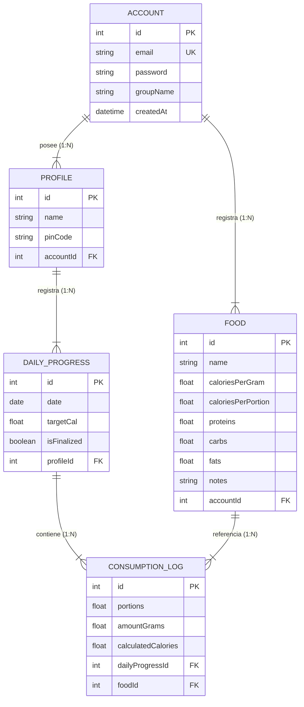

# 🥗 NutriCast — Control Nutricional y Gestión de Perfiles Grupo/Familiar

[](https://github.com/)
[](https://nextjs.org/)
[](https://react.dev/)
[](https://nestjs.com/)
[](https://www.typescriptlang.org/)
[](https://tailwindcss.com/)
[](https://typeorm.io/)
[](https://deepmind.google/)

> [!NOTE]
> 🚧 **Estado del Proyecto: En Desarrollo (Work in Progress)**  
> NutriCast se encuentra actualmente en fase activa de desarrollo y refinamiento continuo. Las funcionalidades del núcleo (autenticación, arquitectura REST HATEOAS Nivel 3, gestión de grupos/perfiles multi-usuario y base de datos relacional) se encuentran operativas y en constante iteración.

**NutriCast** es una plataforma web full-stack diseñada para el seguimiento nutricional diario, cálculo de calorías y macronutrientes, y gestión de grupos de perfiles multi-usuario bajo una única cuenta de acceso.

---

## 🛠️ Tecnologías Utilizadas

| Capa | Tecnología / Herramienta | Descripción / Rol |
| :--- | :--- | :--- |
| **Frontend** | **Next.js 16 (Turbopack)** | Framework React para renderizado eficiente y arquitectura por App Router |
| | **React 19** | Biblioteca de UI declarativa basada en componentes e Hooks |
| | **Tailwind CSS v4** | Sistema de diseño responsivo, temas de color mint/esmeralda y animaciones |
| | **Axios & Lucide React** | Cliente HTTP tipado e iconografía vectorial moderna |
| **Backend** | **NestJS 11** | Framework de Node.js progresivo y modular en TypeScript |
| | **Passport & JWT** | Autenticación con tokens portadores (Bearer Tokens) y hashing Bcrypt |
| | **HATEOAS Custom Interceptors** | Enlaces dinámicos de hipertexto para navegación REST nivel 3 |
| **Base de Datos** | **TypeORM** | ORM relacional para consultas de alto rendimiento y migraciones |
| | **PostgreSQL / SQLite** | Motor de base de datos relacional para persistencia de datos |
| **IA / DevTool** | **Google DeepMind Antigravity** | Agente de IA para desarrollo agéntico, pair programming y refactorización |

---

## 🔗 1. Manejo de Frontend + Backend

NutriCast utiliza una arquitectura totalmente desacoplada basada en el estándar **REST HATEOAS (Level 3)**.

### 🔄 Integración Cliente-Servidor
- **Comunicación HTTP/JSON**: El frontend (Next.js en `:3000`) consume la API REST del backend (NestJS en `:3001`) mediante una instancia configurada de `Axios` (`apiClient`) con interceptores para adjuntar automáticamente el encabezado `Authorization: Bearer <token>`.
- **HATEOAS (Hypermedia As The Engine Of Application State)**: El backend devuelve metadatos `_links` en cada respuesta de las entidades (`Accounts`, `Profiles`, `Foods`, `DailyProgress`, `ConsumptionLogs`), permitiendo al frontend conocer las acciones disponibles de manera dinámica:
```json
{
  "account": {
    "id": 1,
    "email": "familia@nutricast.com",
    "groupName": "Familia Pérez"
  },
  "_links": {
    "self": { "href": "/auth/me", "method": "GET" },
    "profiles": { "href": "/profiles/account/1", "method": "GET" },
    "foods": { "href": "/foods/account/1", "method": "GET" }
  }
}
```

### 🛡️ Autenticación y Guards de Navegación
- **Global `JwtAuthGuard`**: Registrado a nivel global en NestJS mediante `APP_GUARD`. Las rutas públicas se decoran con `@Public()`.
- **Inyección Tipada de Cuentas**: Decorador personalizado `@CurrentAccount()` que extrae el usuario autenticado desde el contexto de ejecución.
- **Guard de Perfil Activo en Frontend**: Si un usuario autenticado intenta acceder al Dashboard (`/dashboard`) o a la Lista de Alimentos (`/foods`) sin haber seleccionado previamente un perfil activo (`selected_profile_id`), el cliente redirige automáticamente a la vista estilo Netflix de selección de grupo (`/group`).

---

## 🗄️ 2. Manejo de Base de Datos

El almacenamiento y la integridad de los datos se gestionan mediante **TypeORM** utilizando un esquema relacional normalizado.

### 📐 Modelo Entidad-Relación (ER)



### 🔒 Estrategias de Seguridad y Datos
- **Protección de Credenciales**: La columna `password` de `Account` utiliza `{ select: false }` en TypeORM y contraseñas encriptadas con `bcrypt` (10 rondas).
- **Auto-Provisionamiento**: Al registrar una nueva cuenta (`/auth/register`), el backend crea automáticamente el grupo de la cuenta y su primer perfil por defecto (*"Usuario 1"*).
- **Protección con PIN**: Cada perfil dentro de un grupo puede contar con un `pinCode` opcional de 4 dígitos para controlar el acceso individual.

---

## 🤖 3. Uso de Inteligencia Artificial en el Desarrollo

El desarrollo de **NutriCast** fue impulsado mediante metodologías agénticas de Pair Programming con **Google DeepMind Antigravity AI Engine**.

### 🌟 Aportes Clave de la Inteligencia Artificial:

1. **Diseño de Arquitectura y Patrones REST/HATEOAS**:
   - Asistencia en la modularización de NestJS, creación de interceptores HATEOAS genéricos y estructuración de controladores tipados.
2. **Desarrollo Agéntico Móvil & Web Responsivo**:
   - Implementación y refactorización de interfaces modernas (Vista de Perfiles Estilo Netflix, barra flotante responsiva, componentes pill buttons).
3. **Optimización de Código y Detección de Errores**:
   - Identificación de renders en cascada (`react-hooks/set-state-in-effect`) y corrección preventiva garantizando **0 errores y 0 advertencias** en compilaciones de producción (`npm run build` & `npm run lint`).
4. **Iteración Rápida de Feedback Visual**:
   - Generación y refinamiento iterativo de elementos UI manteniendo coherencia estética basada en la paleta oficial (`#368482`, `#0c7336`, `#f3f7e6`, `#d5f7e6`).

---

## 🚀 Instalación y Ejecución Local

### 1. Clonar el repositorio
```bash
git clone https://github.com/tu-usuario/NutriCast.git
cd NutriCast
```

### 2. Configurar y Ejecutar el Backend (NestJS)
```bash
cd backend
npm install
npm run start:dev
```
El servidor backend se iniciará en `http://localhost:3001`.

### 3. Configurar y Ejecutar el Frontend (Next.js)
```bash
cd ../frontend
npm install
npm run dev
```
La aplicación web estará disponible en `http://localhost:3000`.

---

## 📄 Licencia

Este proyecto está bajo la licencia MIT.
